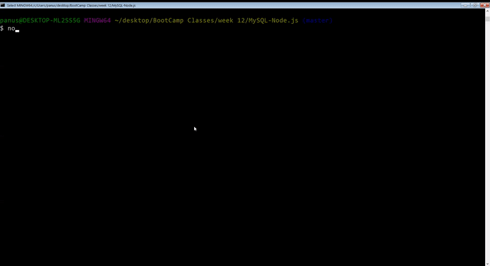

# Bamazon
An Amazon-like storefront by using MySQL, and Node.js

## Third-party Node Modules
Bamazon uses these node modules, and all dependencies in the package.json, so just run:

*npm install*

## A View From the Application

</img>

## Customer Module
* The customer module lets users select a product to purchase, enter the number of items they wish to purchase, and then complete the purchase.

* At the end of the purchase process, it will show how much the total cost is (based on number of items you purchased).

* The customer module also updates to the total sales for a department, based on the purchased product's department.

* Run 'ctrl + c' to exit each mode

## Manager Module

* The manager module lets managers view the list of products, view low inventory, add inventory, and add products.

* Managers can see if the inventory is low, as well as adding new product.

## Technologies Used:
* Javascript
* Node.js
* MySQL
* npm packages:
  * mysql
  * inquirer
  * dotenv
  * cli-table